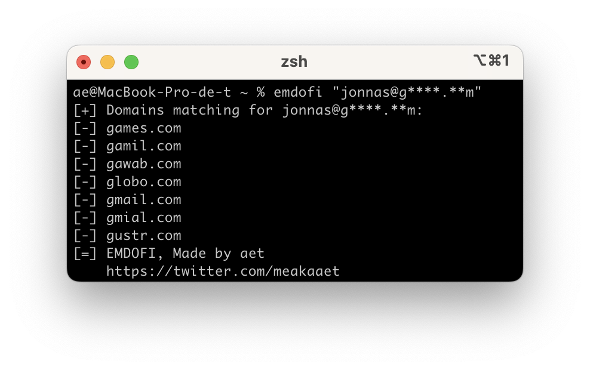

# 🔦 EMDOFI - Censored domains uncovering
**⚠️ Any deviations from the license will result consequences. Contact me if you have doubts.**

---

### ⬇️ Installation
(you can copy the whole line)
```py
git clone https://github.com/novitae/emdofi && cd emdofi && pip install .
```
### 💻 Usage as a command line
`emdofi <domain or email> [-h] [-c CENSORED_CHARS]`
```
usage: EMDOFI - Uncover a censored domain [-h] [-c CC] domain

positional arguments:
  domain                The censored domain or email

options:
  -h, --help            show this help message and exit
  -c CC, --censored CC  The censored characters (default: "*?")
```
### 📚 Usage as a library
#### `match`
This is the simplest action, just making a match, without having to load a lot of stuff.
```py
>>> from emdofi import match
>>> match("*******@c****.c*********m")
[cable.comcast.com]
>>> # You can also define the censored chars with censored_chars.
>>> # It needs to be an iterable of string.
>>> match("*******@c****.c***????**m", censored_chars="*?")
[cable.comcast.com]
```
#### `DomainFinder`
`DomainFinder` is the main class that will make the whole work. It gets initialized manually this way:
```py
>>> from emdofi import DomainFinder
>>> d = DomainFinder(
...     domains = ["gmail.com","yahoo.com","icloud.com"],
...     censoring_chars = "*?"
... )
>>> # If you disable `keep_only_valid_domains` in `DomainFinder`,
>>> # the domains that might be not corresponding to a valid
>>> # domain will be kept.
```
**BUT** you can also initialize it with easier ways:
```py
>>> # Load the default library of domains, present here:
>>> # https://gist.github.com/ammarshah/f5c2624d767f91a7cbdc4e54db8dd0bf/
>>> d = DomainFinder.load_default()
>>>
>>> # Load from a file, that must be containing
>>> # a domain on each line, or is a json list
>>> # of domains.
>>> with open("file.txt", "r") as read:
>>>     d = DomainFinder.load(read)
>>>
>>> # Load from a string that could be contained
>>> # in the file upper described.
>>> d = DomainFinder.loads("gmail.com\nyahoo.com\nicloud.com")
```
Once the `DomainFinder` object intialized, you can re-edit the censored chars with:
```py
>>> d.change_censoring_chars(
...     "*", "?", "£$?"
... )
>>> # The chars will be unpacked as the following:
>>> d.change_censoring_chars("fffç&", "*", "$$&")
>>> d.censoring_chars
["f", "ç", "&", "*", "$"]
```
Then you can start your matches:
```py
>>> d.match("g****.**m")
["gmail.com", "gmial.com"]
>>> # You can use an email, it will only inspect the domain
>>> d.match("john@g****.**m")
["gmail.com", "gmial.com"]
>>> # By using the arg `full`, you will get the whole dict
>>> # such as {domain(str): result(bool), ...}
>>> d.match("g****.**m", full=True)
{"gmail.com": True, "...": False, "...": False, "gmial.com": True, ...}
```
#### `CensoredDomain`
In the case you would like to match different domains being censored with differents characters each, you should use `CensoredDomain`
```py
>>> # Make sure the `censored_chars` is a list of string,
>>> # they won't be converted, so it can cause errors if
>>> # they are not from this specific `list[str]` type.
>>> cd1 = CensoredDomain(
...     "john@g****.**m",
...     censored_chars = ["*"]
... )
>>> cd2 = CensoredDomain(
...     "john@g$)$$.%%m",
...     censored_chars = ["$",")","%"]
... )
>>> for x in [cd1, cd2]:
...     print(x.domain, d.match(x))
"g****.**m", ["gmail.com", "gmial.com"]
"g$)$$.%%m", ["gmail.com", "gmial.com"]
```
#### `SingleDomain`
You can also try to make single matches, using object `SingleDomain`:
```py
>>> import asyncio
>>> sd = SingleDomain(
...     "icloud.com"
... )
>>> # SingleDomain also contains an arg `valid`. Put it on
>>> # `True` or `False` if you want to force its value, its
>>> # default value is `None`
>>> 
>>> # Then you can compare it to a `CensoredDomain` object:
>>> asyncio.run(sd.match(cd1))
False
>>> # I know, it is boring in async, but it allows to make
>>> # a bulk comparing within seconds for millions of domains.
```